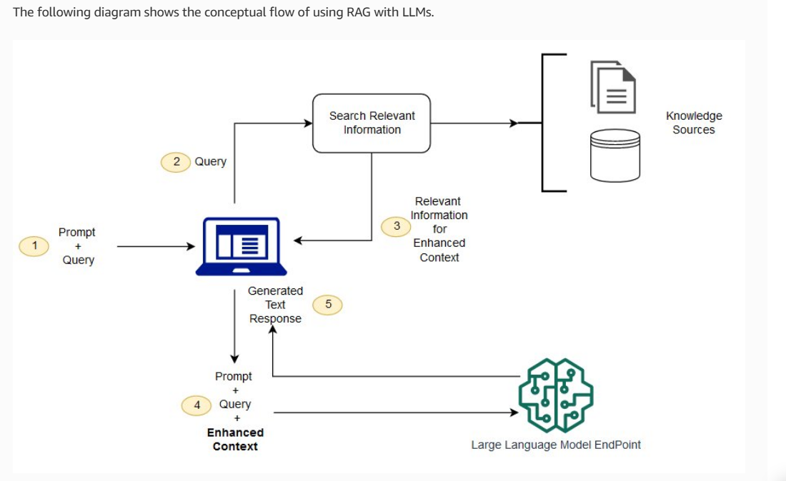

# Predusk-Technology

# 📘 AI-Powered PDF or Plain Text Q&A System

## 🚀 Overview
This project is a **Document Question-Answering System** built with **Flask**, **Google Gemini**, **Cohere**, and **Pinecone**.  
Users can upload **PDFs or raw text**, which are split into chunks, embedded using **Google Generative AI embeddings**, and stored in **Pinecone**.  
When a user asks a question:
1. The query is rewritten into a standalone form (via Gemini).
2. Relevant chunks are retrieved from Pinecone.
3. Cohere reranks results for accuracy.
4. Gemini generates the final context-based answer.

---

## 🏗️ Architecture
 <!-- Add your diagram -->

**Workflow:**
1. **Upload PDF/Text** → Process & Chunk → Store in Pinecone  
2. **Ask Question** → Query Rewriter (Gemini)  
3. **Retriever** (Pinecone + Gemini embeddings)  
4. **Reranker** (Cohere)  
5. **Answer Generator** (Gemini with context)  

---

## ⚙️ Configuration

### 📑 Chunking Parameters

chunk_size: 1000  (which is basically between 800-1200 tokens)

chunk_overlap: 150  (which is 15% of chunk size)

🔍 Retriever / Reranker
Retriever: Pinecone Vector DB (Google Generative AI embeddings)

Reranker: Cohere Rerank v3.0

🌐 Providers Used
Google Generative AI (Embeddings + Gemini Model)

Cohere API (Reranking)

Pinecone (Vector Database)

Flask (Backend Framework)

🌍 Deployment
This project is deployed on Render.
🔗 Live App: [http://localhost:5000](https://predusk-technology-1.onrender.com/)

📝 Remarks
⚠️ Free tier limits on Gemini, Cohere and Pinecone may restrict requests.

# Gemini:
I use Gemini API KEY for LLM and Embedding. it is free but limited to access.

In Following Table showing the limit of Gemini:
-----------------------------------------------------------------
| Limit Type	              |    Free Tier Value                |
-----------------------------------------------------------------
| Max input tokens	        |    1,048,576 tokens per request   |
| Max output tokens	        |    8,192 tokens per response      |
| Estimated daily requests	|    Around 1,500/day per guide     | 
| Alternate user report	    |    About 500/day                  |
-----------------------------------------------------------------

# Cohere:
I use Cohere free api key but it is limited to access (10  request per min)
---------------------------------------
| Endpoint       |	Trial rate limit  |	
---------------------------------------
| Rerank	       |  10/min            |
---------------------------------------

⚠️ Pinecone free index has size & query limits.

In Following Table showing the limit of Pinecone:
-------------------------------------------------------------------------------------------------------------------
| Resource/Limit                                 |  Value                                                          |
| ---------------------------------------------- | -------------------------------------------------------------- |
| Read Units (monthly)                           |  1,000,000                                                      |
| Write Units (monthly)                          |  2,000,000                                                      |
| Upsert Size (per sec)                          |  50 MB per namespace                                            |
| Query Read Units (per sec per index)           |  2,000                                                          |
| Update Records (per sec)                       |  100 per namespace                                              |
| Fetch Requests (per sec)                       |  100 per index                                                  |
| List Requests (per sec)                        |  200 per index                                                  |
| Describe Index Stats (per sec)                 |  100 per index                                                  |
| Delete Records (per sec)                       |  5,000 per namespace / 5,000 per index                          |
| Projects per Org                               |  1                                                              |
| Indexes per Project                            |  Up to 5                                                        |
| Storage per Project                            |  2 GB                                                           |
| Namespaces per Index                           |  Up to 100                                                      |
| Collections per Project                        |  Up to 100                                                      |
| Vector Capacity (1536-d)                       |  ~100,000 vectors (scaled proportionally for other dimensions)  |
| Free Plan Storage After Serverless Upgrade     |  ~300,000 records (~2 GB)                                       |
-------------------------------------------------------------------------------------------------------------------

🚀 Improvements to consider:

1. Add authentication & user accounts.

2. Store chat history in a database.

3. Extend support for DOCX/TXT uploads.

4. Frontend improvements.

