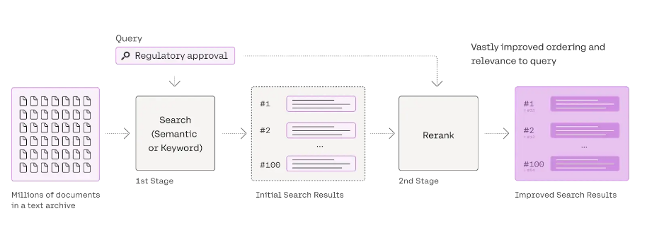

# Predusk-Technology

# 📘 AI-Powered PDF or Plain Text Q&A System

## 🚀 Overview
This project is a **Document Question-Answering System** built with **Flask**, **Google Gemini**, **Cohere**, and **Pinecone**.  
Users can upload **PDFs or raw text**, which are split into chunks, embedded using **Google Generative AI embeddings**, and stored in **Pinecone**.  
When a user asks a question:
1. The query is rewritten into a standalone form (via Gemini).
2. Relevant chunks are retrieved from Pinecone.
3. Cohere reranks results for accuracy.
4. Gemini generates the final context-based answer.

**--------------------------------------------------------------------------------------------------------------------------------------------------**

## 🏗️ Architecture
 
 

**Workflow:**
1. **Upload PDF/Text** → Process & Chunk → Store in Pinecone  
2. **Ask Question** → Query Rewriter (Gemini)  
3. **Retriever** (Pinecone + Gemini embeddings)  
4. **Reranker** (Cohere)  
5. **Answer Generator** (Gemini with context)  

**----------------------------------------------------------------------------------------------------------------------------------------------------**
## ⚙️ Configuration

### 📑 Chunking Parameters

**chunk_size:**  1000  (which is basically between 800-1200 tokens)

**chunk_overlap:** 150  (which is 15% of chunk size)

**-------------------------------------------------------------------------------------------------------------------------------------------------------**
### 🔍 Retriever / Reranker
Retriever: Pinecone Vector DB (Google Generative AI embeddings)

Reranker: Cohere Rerank v3.0

**----------------------------------------------------------------------------------------------------------------------------------------------------**

### 🌐 Providers Used
1. Google Generative AI (Embeddings + Gemini Model)

2. Cohere API (Reranking)

3. Pinecone (Vector Database)

4. Flask (Backend Framework)

**-------------------------------------------------------------------------------------------------------------------------------------------------------**

### 🌍 Deployment

This project is deployed on Render.

🔗 Live App: https://predusk-technology-1.onrender.com

**-------------------------------------------------------------------------------------------------------------------------------------------------------------**
### 📝 Remarks

**⚠️ Gemini:**
I use Gemini API KEY for LLM and Embedding. it is free but limited to access.

In Following Table showing the limit of Gemini:

-----------------------------------------------------------------
| Limit Type	              |    Free Tier Value                |
| ------------------------- | --------------------------------- |
| Max input tokens	        |    1,048,576 tokens per request   |
| Max output tokens	        |    8,192 tokens per response      |
| Estimated daily requests	|    Around 1,500/day per guide     | 
| Alternate user report	    |    About 500/day                  |
-----------------------------------------------------------------

**⚠️ Cohere:**

I use Cohere free api key but it is limited to access (10  request per min)

---------------------------------------
| Endpoint       |	Trial rate limit  |	
| -------------- | ------------------ |
| Rerank	       |  10/min            |
---------------------------------------

**⚠️ Pinecone** 

In Following Table showing the limit of Pinecone:

-------------------------------------------------------------------------------------------------------------------
| Resource/Limit                                 |  Value                                                          |
| ---------------------------------------------- | --------------------------------------------------------------  |
| Read Units (monthly)                           |  1,000,000                                                      |
| Write Units (monthly)                          |  2,000,000                                                      |
| Upsert Size (per sec)                          |  50 MB per namespace                                            |
| Query Read Units (per sec per index)           |  2,000                                                          |
| Update Records (per sec)                       |  100 per namespace                                              |
| Fetch Requests (per sec)                       |  100 per index                                                  |
| List Requests (per sec)                        |  200 per index                                                  |
| Describe Index Stats (per sec)                 |  100 per index                                                  |
| Delete Records (per sec)                       |  5,000 per namespace / 5,000 per index                          |
| Projects per Org                               |  1                                                              |
| Indexes per Project                            |  Up to 5                                                        |
| Storage per Project                            |  2 GB                                                           |
| Namespaces per Index                           |  Up to 100                                                      |
| Collections per Project                        |  Up to 100                                                      |
| Vector Capacity (1536-d)                       |  ~100,000 vectors (scaled proportionally for other dimensions)  |
| Free Plan Storage After Serverless Upgrade     |  ~300,000 records (~2 GB)                                       |
-------------------------------------------------------------------------------------------------------------------

**---------------------------------------------------------------------------------------------------------------------------------------------------------**
### Minimal Evaluation

**Perfect 👍 I created 5 Q/A pairs. I can use these as your gold set for evaluation of your RAG system.**

**Q1. What is the time complexity of inserting a node at the head or tail of a linked list in DSA?**
Actual answer: The time complexity is O(1) (constant time), since head and tail pointers are maintained
RAG answer: In DSA, if the linked list maintains pointers to both the head and tail, the time complexity of inserting a new node at the beginning (head) or end (tail) of the list is O(1).

**Q2. What is the major difference between a singly linked list and a doubly linked list?**
Actual answer: In a singly linked list, each node has a reference only to the next node, while in a doubly linked list, each node has references to both the next and previous nodes
RAG answer: The primary structural difference between a singly linked list and a doubly linked list is that each node in a doubly linked list contains a pointer to both the next and the previous node, allowing for forward and backward traversal, whereas a singly linked list only contains a pointer to the next node.

**Q3. What is the time complexity of insertion in a Binary Search Tree (BST) when it is balanced?**
Actual answer: Insertion in a balanced BST takes O(log n) time
RAG answer: Insertion in a balanced Binary Search Tree (BST) has a time complexity of O(log n).

**Q4. What is the runtime efficiency of heap insertion?**
Actual answer: Heap insertion has a runtime of O(log n), because after inserting into the array, we must validate heap order (via heapify)
RAG answer: The run time efficiency for heap insertion is O(log n). The run time is a byproduct of verifying heap order as the first part of the algorithm (the actual insertion into the array) is O(1).

**Q5. What are the four main types of tree traversal strategies?**
Actual answer: The four types are: Preorder, Inorder, Postorder, and Breadth-First traversa
RAG answer: The provided document mentions these tree traversal strategies:
1. Preorder
2. Postorder
It also refers to inorder traversal.

**📊 Minimal Evaluation Note**

**Number of Q/A pairs tested: 5**

**Results:**

Q1 → ✅ Correct

Q2 → ✅ Correct

Q3 → ✅ Correct

Q4 → ✅ Correct

Q5 → ✅ Partially correct (Your answer listed Preorder, Postorder, and Inorder but missed Breadth-First, which is also in the document.)

**Success Rate: 4.5/5 ≈ 90%**

**Observation: The RAG system is performing well, but sometimes it may omit details (e.g., not listing all traversal types). This suggests recall could be slightly improved by refining chunking or retrieval.**

**Precision: High (most retrieved answers were correct and relevant).**

**Recall: Slightly lower (missed one traversal type).**

**---------------------------------------------------------------------------------------------------------------------------------------------------------**

### 🚀 Improvements to consider:

1. Add authentication & user accounts.

2. Store chat history in a database.

3. Extend support for DOCX/TXT uploads.

4. Frontend improvements.

